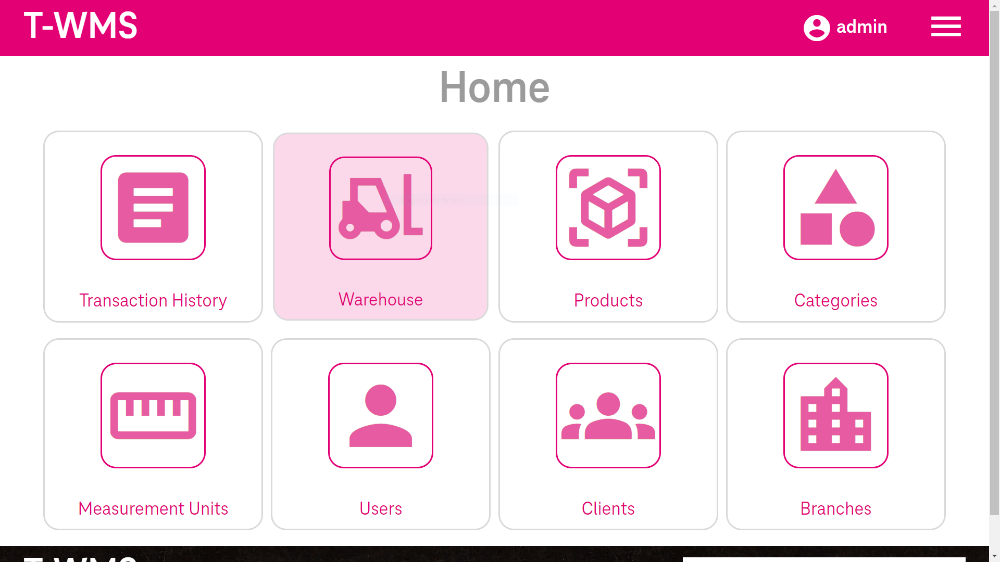
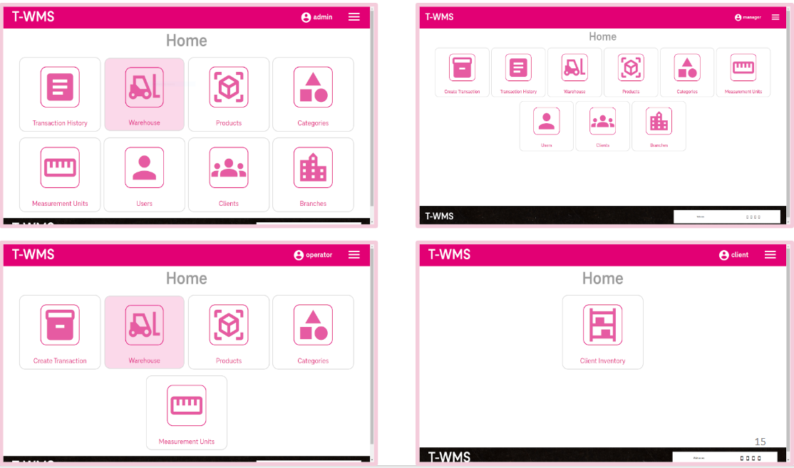

<div align="center">
	
</div>

<div align="center">
</br>
</br>

# Introduction
</div>

This project was developed as the final project for T-Academy. A full stack training program which the focus was on Java and Angular. The program was partnership between [ProWay](https://www.proway.com.br/) and [T-Systems do Brasil](https://www.t-systems.com/br/pt).

The main goal of the project was to create a Warehouse Management System (WMS), that could handle multiple branches, different access levels and with a user-friendly interface.

<div align="center">

<div align="center">

# Database schema

</div>

<div align="center">
	
</div>

# Our Team
</div>

[Anderson Carneiro Sousa](https://github.com/a-cs)

[Bianca Eliza Corrêa](https://github.com/biancaec)

[Guilherme Camargo](https://github.com/gcamarg)

[Luiz Cirilo Tomasi Neto](https://github.com/Luiz-Tomasi)

[Matheus Santos Vieira](https://github.com/heavymsv)

[Rafael Bruno Prates Barbosa Cardoso](https://github.com/rafaprates)

<div align="center">

# The Stack
</div>

<div style="display: flex; flex-direction:row; justify-content:space-between;">

<div>

## Back end
- [x] MySQL
- [x] Java
- [x] Spring Boot
- [x] Spring Security

</div>

<div>

## Front end
- [x] HTML
- [x] CSS
- [x] Typescript
- [x] Angular
- [x] Material

</div>

</div>

<div align="center">

# How to run
</div>

Clone the repository:

```bash
git clone https://github.com/a-cs/t-academy
```
</br>
<div align="center">

## For the Back end:
</div>

</br>

Access the wms folder:

```bash
cd wms
```

</br>

Create a folder called config

</br>

Access the config folder:
```bash
cd config
```
</br>

To set the environment variables, create an application.properties file with the following content:
```
active_profile=dev
emailSender_address=YOUR_EMAIL
emailSender_password=YOUR_EMAIL_PASSWORD
clientInfo.id=YOUR_CLIENT_NAME
clientInfo.secret=YOUR_CLIENT_SECRET
```
##### *Change the data to your information
</br>

Install the dependencies using Maven

</br>

Create a local MySQL database called twms 

</br>

Run the project

</br>
</br>
<div align="center">

## For the Front end:

</div>

</br>

Access the front folder:
```bash
cd front
```

</br>

To set the environment variables, create a .env file with the following content:
```
NG_APP_API="http://localhost:8080/"
```

</br>

Install Angular CLI using NPM
```bash
npm install -g @angular/cli
```

</br>

Install the dependencies using NPM
```bash
npm install
```

</br>

Run the project
```bash
ng serve
```


<div align="center">
  
# Permissions

<div align="center">
	
</div>

</br>

  
|            |                    |                    |         |                    |                    |                    |                    |                    |                    |                    |
|:----------:|:------------------:|:------------------:|:------------------:|:------------------:|:------------------:|:------------------:|:------------------:|:------------------:|:------------------:|:------------------:|  
|**Role**    | **Client Inventory**      | **Products**  | **Measurement Units**       | **Categories**     | **Users**  | **Clients**     | **Branches**     | **Transaction**     | **Transaction_History**     | **Warehouse_Slots**     |
| Client     | :heavy_check_mark::eyes: | :x: |     :x:              |      :x:             |      :x:             |      :x:             |      :x:             |      :x:             |      :x:             |      :x:             |
| Operator |  :x: | :heavy_check_mark::eyes: | :heavy_check_mark::eyes: |      :heavy_check_mark::eyes:            |      :x:              |      :x:             |      :x:             |      :heavy_check_mark::eyes::postbox:            |      :heavy_check_mark::eyes:             |      :heavy_check_mark::eyes:             |
| Manager      | :x: | :heavy_check_mark::crown: | :heavy_check_mark::crown: | :heavy_check_mark::crown: | :heavy_check_mark::crown: | :heavy_check_mark::crown: | :heavy_check_mark::eyes: |      :heavy_check_mark::eyes::postbox:             |      :heavy_check_mark::eyes:             |      :heavy_check_mark::eyes:             |
| Admin      | :x: | :heavy_check_mark::crown: | :heavy_check_mark::crown: | :heavy_check_mark::crown: | :heavy_check_mark::crown: | :heavy_check_mark::crown: | :heavy_check_mark::crown: |      :x:             |      :heavy_check_mark::eyes:             |      :x:             |

</div>

<div align="center">

## Meaning
|||
|:-:|:-:|
|**Emoji**    |   **Meaning**    | 
| :heavy_check_mark:    |  Accessible    |
| :x:     | Inaccessible    |
| :eyes:    |  GET()    |
| :postbox:    |  POST()    |
| :crown:    |  All CRUD methods    |


</div>
